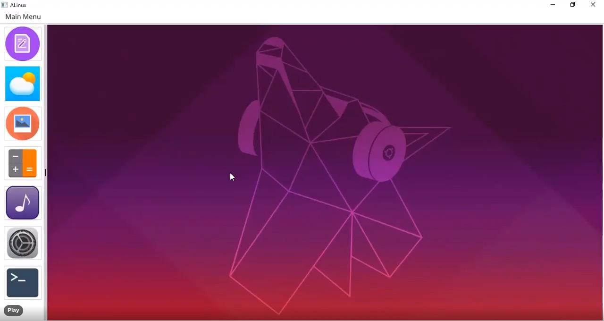
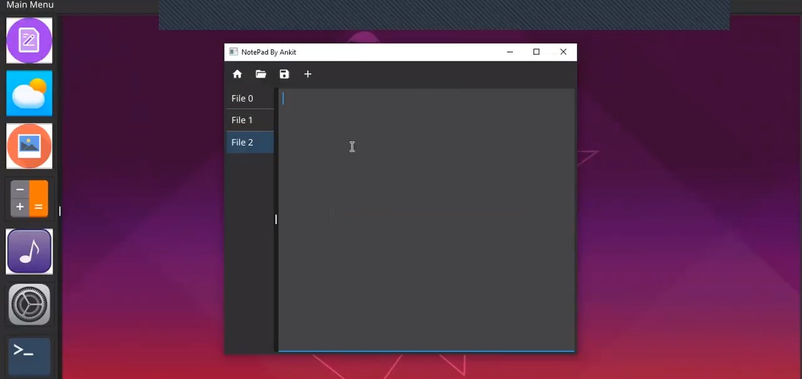
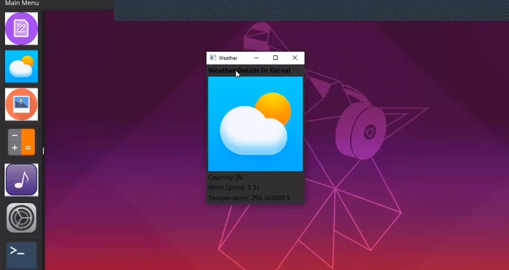
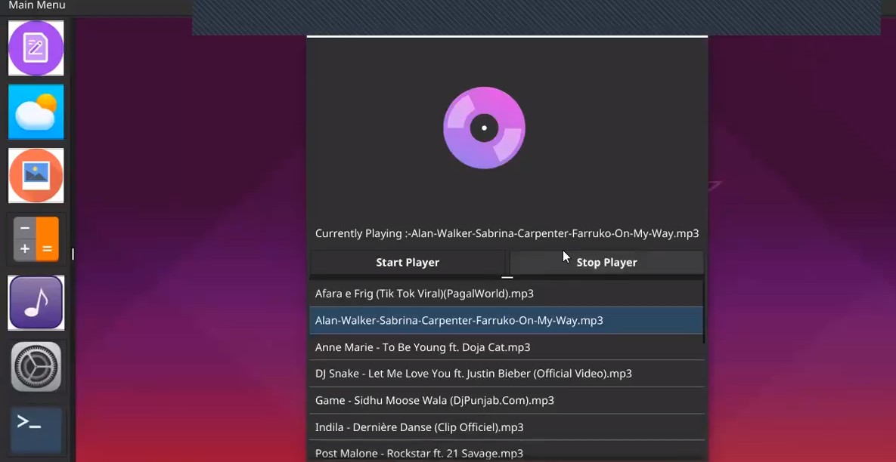
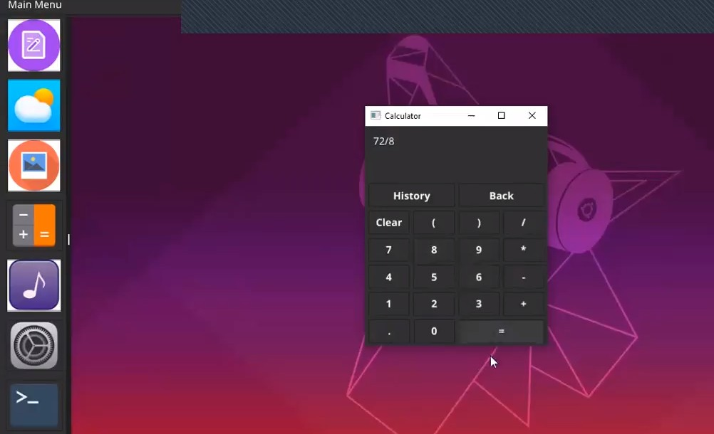

# Virtual Linux Using Golang And Fyne

### Project is to provide linux user inteface to the non linux users by the medium of Desktop Application.


## Code Files :
*   Linux.go : 
    * Main file needed to run in order to use Virtual Linux
*  Individual App Folder :
    * Contains go files for individual apps which are present in linux.
* Music Folder :
    * Add your music in this folder to use in the music app
* Images Folder :
    * Contains images used in the Desktop Application
# View of Virtual Linux :
*   Linux View :
    * 

*   Notepad View :
    * 
*   Weather App :
    * 
*   Music Player :
    * 
*   Calculater App :
    * 

## Video Explanation of the Project :


https://user-images.githubusercontent.com/67190631/171101453-49f84f3c-fdae-4f44-8dd9-4baaadf8781d.mp4


# How to Run  :
* Install the Go language on Pc
* run command   ```go run Linux.go```
